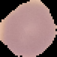
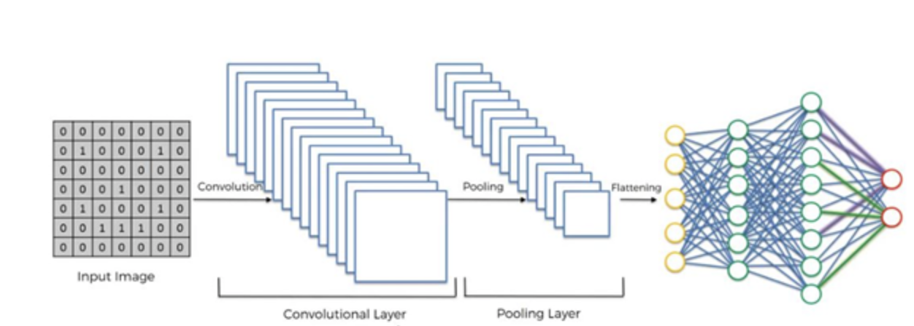
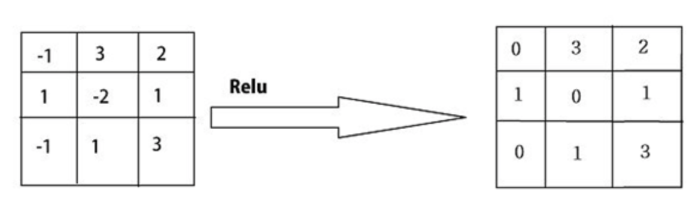

# Image classification of malarial cells using CNN

Implementation of malarial cell classification into healthy and parasitized cells using pretrained VGG-16 convolutional neural networks (CNN). The [dataset](https://lhncbc.nlm.nih.gov/LHC-publications/pubs/MalariaDatasets.html) is available at the national library of medicine.

The task is to train a model that correctly classifies the parasitized from uninfected cell. VGG-16 pretrained model is chosen and tranfer learning is performed from the aforementioned dataset.
<!-- <p align="center">
    
    
</p> -->

<!-- <div class="row">
  <div class="column">
    
  </div>
  <div class="column">
    
  </div>
</div> -->

<figure>
  
  <figcaption>Parasitized</figcaption>
</figure>
<figure>
  
  <figcaption>Uninfected</figcaption>
</figure>


Let's take at look at the overview about architecture of CNN:

## Convolutional Neural Network
Convolutional Neural Network(CNN) is a deep learning algorithm typically used in computer vision and the architecture of is analogous to connectivity of neurons in human brain. By applying suitable filters, a CNN understands the spatial and temporal dependencies in an image. It takes an image as input and updates learnable weights and biases to each group of pixels in an image and correlation among one another. CNN consists of three main components namely, convolutional layers, pooling layer and fully connected layers

<p align="center">
    
</p>

### Convolutional layers
As seen in above figure, the input image with pixel values between 0 and 255 are represented as scaled values from 0 to 1. If the input image is colored, it would contain RGB color channels. Hence, an image can be presented as a 3-dimensional matrix with width, height and number of color channels. Most of the calculation occurs in convolutional layer and it requires several items such as input image, filter/feature detector and a feature map. 

```console
model = keras.models.Sequential()
model.add(Convolution2D(32,3,3, input_shape=(64,64,3), activation='relu'))
```

Here, we look at single convolutional step. To the 2D convolution operator, we pass 32 filters (or) feature detectors of size 3x3, therefore our convolutional layer will consist of 32 feature maps. 

<p align="center">
    
</p>

Input shape is shape of input image with heigh & width as 64 and number of color channels as 3. If we only pass black and white image as input, then the number of color channel would be 1. The argument 'relu' activation function replaces the negative pixel value by 0. The number of filters affects the depth of the output. For example, three distinct filters would yield three different feature maps, creating a depth of three. A CNN is considered as deep depending on the number of feature detectors/filters applied to the image.

### Pooling layers

```console
model.add(MaxPooling2D(pool_size=(2,2)))
```

A Pooling layer reduces the dimension of the feature maps obtained from the convolutional step. It decreases the computational power required to process the data through dimensionality reduction. Here, we have a pooling layer of 2x2 dimension. Let's take a look at below figure,

<p align="center">
    
</p>

2x2 dimensional pooling layer is applied onto 4x4 feature map. Maximum pooling returns the maximum value from the region of feature map covered by pooling kernel. Average pooling returns the average of all the values from the region of feature map covered by pooling kernel. 

#### Flatten step

```console
model.add(Flatten())
```

<p align="center">
    
</p>

As illustrated in the figure, a flatten layer converts a matrix of pixel values(image pixel weights) into a one-column vector. Here, a 3x3 image matrix is flattened into a 9x1 vector. 

### Fully Connected layers

```console
model.add(Dense(output_dim=128, activation='relu')) # hidden layer
model.add(Dense(output_dim=1, activation='sigmoid')) # output layer
```
As the name indicates, all the nodes present in this layer are connected to all nodes in the output layer. output_dim=128 means the number of nodes present in this layer. This hidden layer perform a 'relu' activation function over the features extracted from the previous layers and is connected to a output layer. The number of nodes in the output layer corresponds to the number of classification classes. In this project, we have two classification classes: Parasitized cell and Uninfected cell. Here, we would use one node in output layer and 'sigmoid' activation fuction, producing a probability from 0 to 1. If the probability is closer to 1, then it would be classified as Uninfected cell and if the probability is closer to 0, then it would be classified as Parasitized cell.

## Activation Function
An activation function that is added into an artificial neural network in order to help the network learn complex patterns in the data. When comparing with a neuron-based model that is in our brains, the activation function is at the end deciding what is to be fired to the next neuron. That is exactly what an activation function does in an ANN/CNN as well. It takes an output signal from the previous layer/node and converts it into some form that can be taken as input to the next layer/node.

### ReLU

<p align="center">
    
</p>

Retified Linear Unit(ReLU) is applied per pixel, that replaces all negative pixel values in the feature map by zero.  

### Sigmoid
A sigmoid function is used converts the model's output into a probability score between 0 and 1, which can be easier to interpret in binary classification.

## Dropout layer

<p align="center">
    
</p>

Dropout method is used to prevent a model from overfitting. The Dropout layer randomly sets input units to 0 with a specific frequency rate at each step during training time.  

## Loss function
Error is calculated by evaluvating the difference between the original output and the predicted output. The function that computes the error is called loss function. Here, we are using binary-cross-entropy as the loss function, that calculated the error, which would affect the performance of the model

## Optimization function
The optimization function is a function that changes the internal parameters of the model such that the calculated error (or) the loss function is minimum. 

## Results & Evaluation
Once the model is trained. The model is used to predict on 40 test data samples whether if the cell is infected/uninfected. The obtained predictions are compared with actual value and accuracy of the model is calculated. ROC curve illustrated below tells us the correctness of a trained model. 

<p align="center">
    
</p>

If the highest peak of roc curve is close to 1, then highest the accuracy of the model. Here, we obtained accuracy of our model as 88%, it means that there is a probability of 12% error in its predictions.